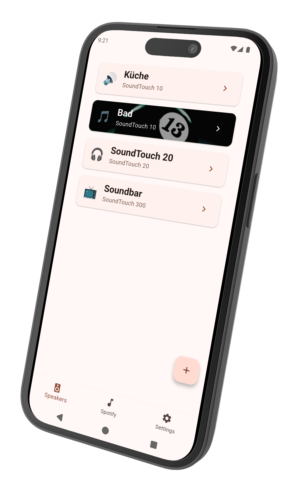
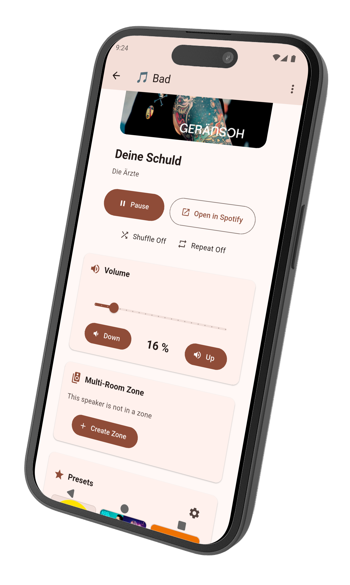
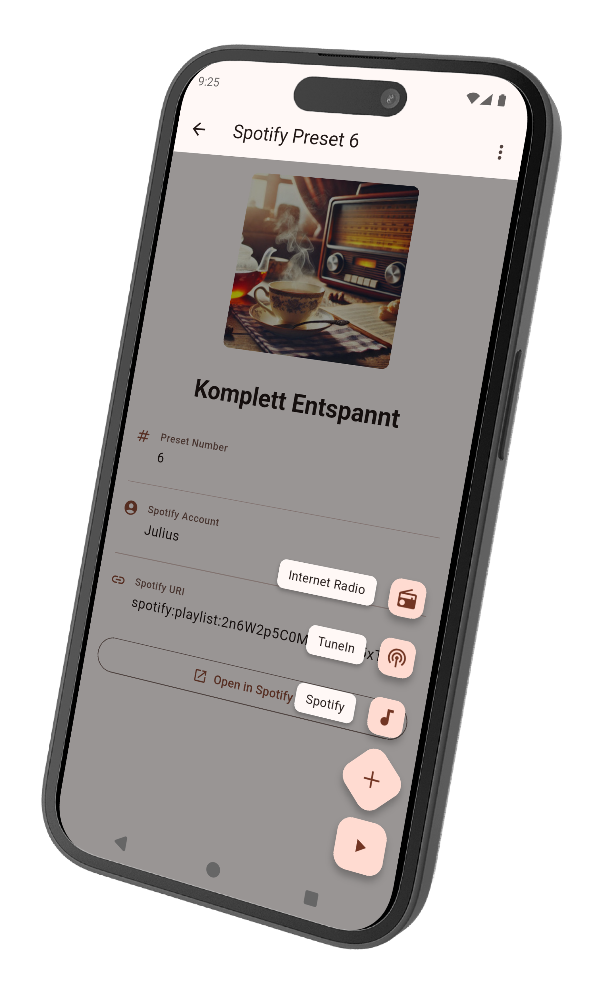
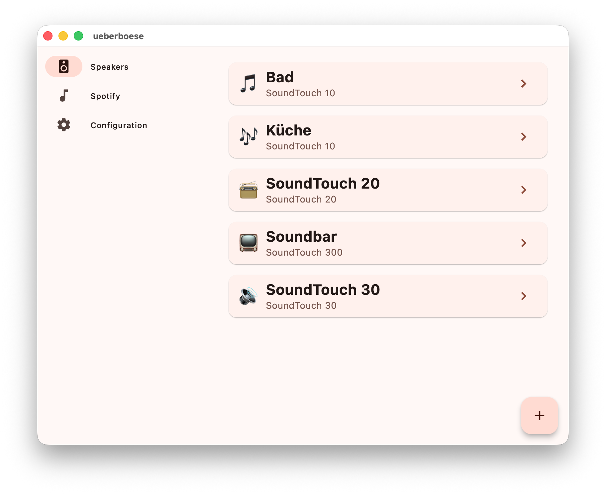
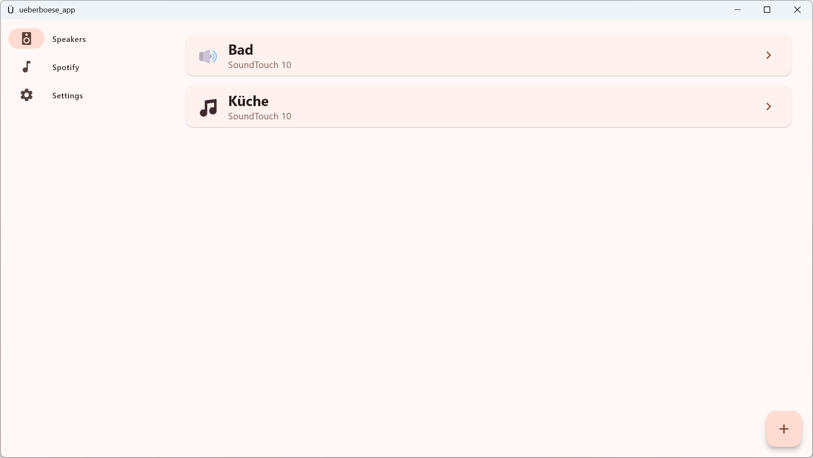

# Überböse App

This app is the companion for the [Überböse API](https://github.com/julius-d/ueberboese-api)

## Features

The app has two main purposes:

1. Set up Spotify auth for your self-hosted Überböse API server
2. Additionally, the app also allows controlling your speakers via the
   [SoundTouch-WebServices-API](https://github.com/thlucas1/homeassistantcomponent_soundtouchplus/wiki/SoundTouch-WebServices-API) 
   that is provided by each speaker.
   - **Presets**: View, play and change the 6 presets for each speaker
   - **Multi-Room Audio**: Control and view speaker zones for synchronized playback
   - **Volume Control**: Adjust volume levels for individual speakers
   - **Now Playing**: See what's currently playing on your speakers
   - **Recently Played**: See what got recently played
   - **New speaker setup**: If you got another SoundTouch speaker, the app has a wizard for the complete setup 

## Screenshots

  
  
  

## Installation

### Via F-Droid (Recommended)

Install and receive automatic updates using F-Droid:

### Via Obtainium

Or you can use Obtainium for installation and updates:

### Manual Installation

Download the latest APK from the [Releases page](https://github.com/julius-d/ueberboese-app/releases/latest) and install it manually on your Android device.

### MacOS

The app is also available as a macOS App. 
It can be downloaded from the [Releases page](https://github.com/julius-d/ueberboese-app/releases/latest)

### Windows 

Same is true for Windows.

